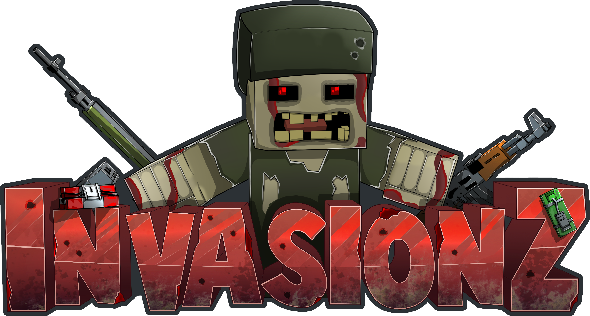
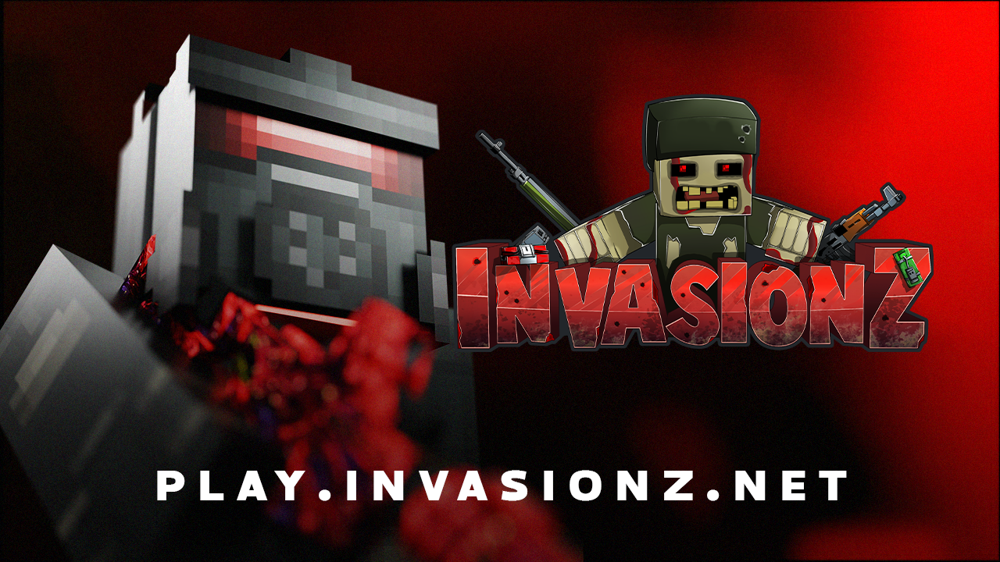

<!-- Improved compatibility of back to top link: See: https://github.com/othneildrew/Best-README-Template/pull/73 -->

<!--
*** Thanks for checking out the Best-README-Template. If you have a suggestion
*** that would make this better, please fork the repo and create a pull request
*** or simply open an issue with the tag "enhancement".
*** Don't forget to give the project a star!
*** Thanks again! Now go create something AMAZING! :D
-->

<!-- PROJECT SHIELDS -->
<!--
*** I'm using markdown "reference style" links for readability.
*** Reference links are enclosed in brackets [ ] instead of parentheses ( ).
*** See the bottom of this document for the declaration of the reference variables
*** for contributors-url, forks-url, etc. This is an optional, concise syntax you may use.
*** https://www.markdownguide.org/basic-syntax/#reference-style-links
-->

<!-- PROJECT LOGO -->
 

  

  <h3 align="center">InvasionZ Minecraft</h3>

  

    Welcome on the InvasionZ Organisation
     
    <a href="https://invasionz.net"><strong>Our Website »</strong></a>
     
     
    <a href="https://discord.invasionz.net">Discord</a>
    &middot;
    <a href="https://wiki.invasionz.net">Wiki</a>
    &middot;
    <a href="https://www.youtube.com/@InvasionZ_Official">Youtube</a>
  

## About The Project

 
 
InvasionZ is a custom Minecraft multiplayer server built on Spigot, set in a post-apocalyptic zombie world. This project focuses on immersive gameplay, survival challenges, and fully customized plugin systems designed specifically for the server.

Key features include:
- ✅ Dynamic zombie waves with unpredictable AI
- 🧟 Evolving infected zones with progression mechanics
- 🎮 Custom classes, gear, and mission systems
- 🛠️ Fully custom-developed plugins tailored to InvasionZ
- 🌍 A hand-crafted, dark and immersive map
 
> The goal? Deliver a true **co-op zombie invasion experience**, where survival, teamwork, and smart decisions are the key to staying alive.
 

InvasionZ is continuously evolving thanks to a solid technical base and a passionate development team.  
Join the world of InvasionZ — if you dare to survive...

### Built With

* 
* 
* 
* 
* 
* 
* 
* 
* 
* 
* 
* 
* 
* 
* 

<!-- CONTACT -->
## Contact

Contact US - contact@invasionz.net

Project Discord: [Discord invasionz](https://discord.invasionz.net)

(<a href="#readme-top">back to top</a>)

